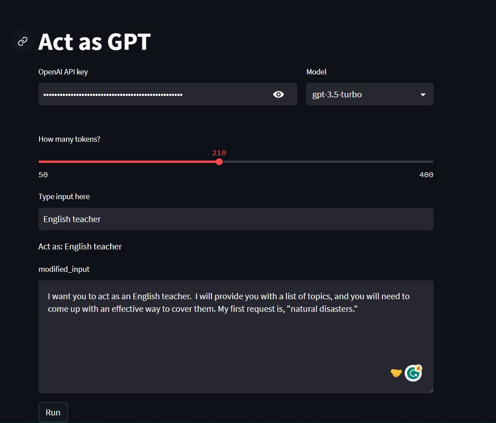
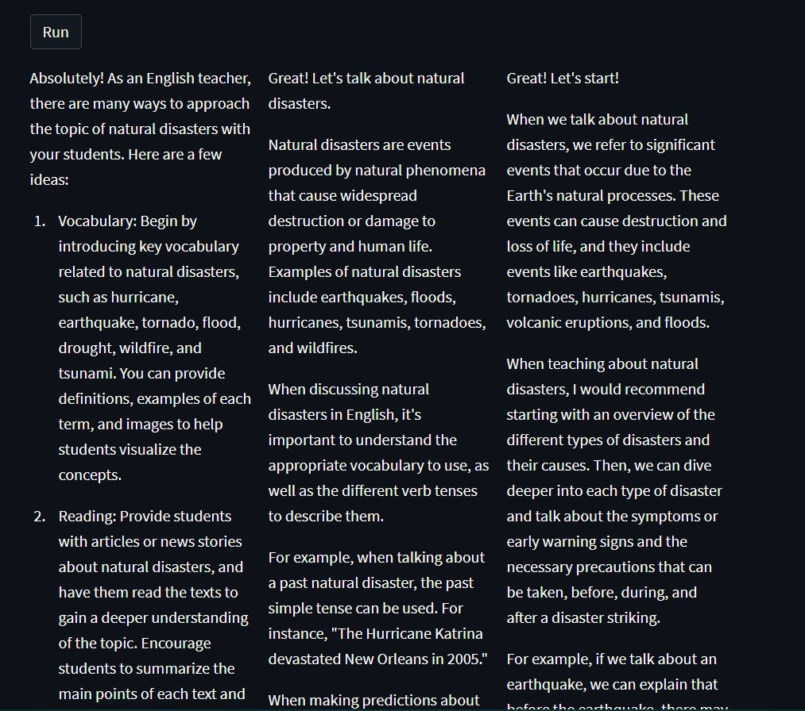

# ActasGPT
 
ActasGPT is an innovative project that leverages cosine_similarity(v1.0) and transformers(v2.0) techniques to enhance prompt prediction. The primary goal is to develop a model capable of accurately predicting highly effective prompts for users, surpassing the limitations of the current database. As part of a third-year project initiative, the transformer model is refined and seamlessly integrated. To launch this project, all you need to do is incorporate your own generative model and GPT-API key.

## Table of Contents
* [Dataset](#Dataset)
* [Repo Structure](#Repo-Structure)
* [Technologies](#Technologies-Used)
* [Website Interface](#Website-Interface)
* [Improved Results](#Improved-Results)
* [Conclusion](#Conclusion)

## Dataset
The project utilizes the remarkable chatgpt prompts dataset:

* [Awesome chatgpt prompts](https://huggingface.co/datasets/fka/awesome-chatgpt-prompts)

The dataset comprises two columns: the input column, which acts as a prompt, and the output column.

## Repo Structure
The project consists of the following folders and files:

- imgs: Contains images for the readme file.
- model: Houses the transformer model, the utilized dataset, and the notebooks used for - training both the recent and initial versions of the program.
- app.py: Manages the website interface.
- utils.py: Provides the backend for the website, encompassing essential functions and API calls.

## Technologies Used
* matplotlib & wordcloud for data visiulization
* NLP for data-preprocessing
* transformers fine tuning & sklearn cosine similarity for model building in both versions
* GPT-API
* Streamlit for UI
* Amazon EC2 for cloud hosting

## Website Interface
The website boasts a user-friendly and intuitive interface, allowing users to enter prompts and receive predictions for the most suitable ones that cater to their specific needs. The transformer model accurately predicts the optimal prompt, which users can conveniently modify before submitting. Upon submission, the server establishes a connection with the GPT-API server, delivering three distinct results that offer users a comprehensive overview of the prompt's output and effectiveness.

### Old version:

## Improved Results
In the initial version, the model utilized cosine similarity, limiting its ability to predict prompts similar to those in the existing database, making it inefficient for real-time tasks. To address this, we fine-tuned a transformer model, primarily developed by [Merve](https://github.com/merveenoyan), to cater to our specific task. Additionally, the model was uploaded to the cloud using AWS.

## Conclusion
This project successfully improves user input prompts, providing users with the opportunity to modify the generated prompt before submitting it to the GPT-API server. The resulting prompt outputs are then displayed, enhancing the prompt selection process.

## License
Distributed under the GNU  License. See `LICENSE` for more information.
